# Vyan - Battery Swap Ecosystem

An EV Battery Swapping, De-PIN ecosystem on the Sei Blockchain with AI powered inventory rebalancing.

## 🚀 Project Overview

Vyan is a decentralized battery swap network that enables electric vehicle users to quickly swap their depleted batteries for fully charged ones. The system includes:

- **Mobile App**: Find stations, view capacity, and manage tokens
- **Station Interface**: Raspberry Pi-based station control system
- **Smart Contract**: SwapToken ERC20 contract for rewards and staking
- **Backend**: API for station management and user data

## 🏗️ Architecture

```
┌─────────────────┐    ┌─────────────────┐    ┌─────────────────┐
│   Mobile App    │    │ Station Interface│    │  Smart Contract │
│   (Frontend)    │◄──►│                  │◄──►│   (Vyan)   │
└─────────────────┘    └─────────────────┘    └─────────────────┘
         │                       │                       │
         └───────────────────────┼───────────────────────┘
                                 │
                    ┌─────────────────┐
                    │    Backend API  │
                    │   (Node.js)     │
                    └─────────────────┘
```

## 🔄 Complete System Flow

```mermaid
flowchart TD
    %% User Frontend
    A[User opens app] --> B[Find nearest station]
    B --> C[Arrive at station]
    C --> D[Scan QR code]
    
    %% Station Interface
    E[Station Interface displays QR] --> F[QR refreshes every 30s]
    D --> G[QR scanned by user]
    G --> H[Station shows: Hi username, follow Vyan App instructions]
    H --> I[Abort button available]
    
    %% Frontend Session Start
    G --> J[Frontend gets stationId]
    J --> K[Call /session/start with station_id, user_id]
    K --> L[Call getStationDetails contract function]
    L --> M[Show: Connected to Z station, station info, battery status]
    
    %% Battery Insertion
    M --> N[Message: Insert discharged battery and press button]
    N --> O[User inserts battery]
    O --> P[User clicks 'Discharged battery inserted' button]
    P --> Q[Show: Battery X inserted]
    
    %% Payment Flow
    Q --> R[Call calculateSwapFee contract function]
    R --> S[Show estimated price]
    S --> T[Slider button to confirm payment]
    T --> U[Call swapBattery on-chain via Thirdweb]
    U --> V[Payment confirmed]
    
    %% Battery Release
    V --> W[Show: Battery Y released]
    W --> X[Trigger AI agent monitoring]
    
    %% AI Agent Flow
    X --> Y[AI Agent listens to BatterySwapped events]
    Y --> Z[Query station for remaining batteries]
    Z --> AA{Station needs refueling?}
    AA -->|Yes| BB[Query all stations using getAllStations]
    BB --> CC[AI generates rebalancing plan considering:]
    CC --> DD[• Closest proximity]
    CC --> EE[• Real-time traffic]
    CC --> FF[• Battery availability]
    CC --> GG[• Demand patterns]
    CC --> HH[• Rebalance truck availability]
    CC --> II[• Past 7 days usage data]
    
    %% AI Plan Execution
    DD --> JJ[Generate optimal rebalancing strategy]
    EE --> JJ
    FF --> JJ
    GG --> JJ
    HH --> JJ
    II --> JJ
    JJ --> KK[Emit AIRebalanceRequested event on-chain]
    
    %% Operator Dashboard
    KK --> LL[Web frontend polls for AIRebalanceRequested events]
    LL --> MM[Show rebalancing strategies to operator]
    MM --> NN[Operator reviews and executes strategy]
    NN --> OO[Update station inventory]
    
    %% Station Interface Success
    W --> PP[Station interface shows success for 10 seconds]
    PP --> QQ[Return to home page with new session]
    
    %% Session Management
    K --> RR[FastAPI server manages dynamic sessions]
    RR --> SS[Session state tracking]
    
    %% Contract Interactions
    L --> TT[Smart contract state updates]
    U --> TT
    KK --> TT
    
    %% Styling
    classDef frontend fill:#e1f5fe,stroke:#01579b,stroke-width:2px
    classDef station fill:#f3e5f5,stroke:#4a148c,stroke-width:2px
    classDef contract fill:#e8f5e8,stroke:#1b5e20,stroke-width:2px
    classDef server fill:#fff3e0,stroke:#e65100,stroke-width:2px
    classDef ai fill:#fce4ec,stroke:#880e4f,stroke-width:2px
    classDef operator fill:#f1f8e9,stroke:#33691e,stroke-width:2px
    
    class A,B,C,D,J,K,L,M,N,O,P,Q,R,S,T,U,V,W frontend
    class E,F,G,H,I,PP,QQ station
    class L,R,U,KK,TT contract
    class K,RR,SS server
    class X,Y,Z,AA,BB,CC,DD,EE,FF,GG,HH,II,JJ ai
    class LL,MM,NN,OO operator
```



## 📱 User Journey

1. **Find Station**: User opens app, finds nearest station with capacity
2. **Scan QR Code**: User arrives at station and scans the QR code displayed on the station interface
3. **Session Start**: App automatically connects to the station and shows station details, battery status, and estimated swap fee
4. **Insert Battery**: User inserts their discharged battery and confirms via the app
5. **Payment & Confirmation**: User confirms payment using the slider button, pays via Thirdweb integration
6. **Battery Release**: Once payment is confirmed, a fresh battery is automatically released from the station
7. **AI Monitoring**: The system automatically monitors station inventory and triggers rebalancing when needed
8. **Token Reward**: User receives SwapTokens in their wallet for completing the swap
9. **Redeem**: Tokens can be staked for priority lane access or used for discounts on future swaps

### Station Operator Flow
- **Real-time Monitoring**: Web dashboard shows live station status and AI-generated rebalancing recommendations
- **AI-Powered Insights**: System analyzes traffic patterns, demand forecasts, and proximity to optimize battery distribution
- **Automated Alerts**: Receive notifications when stations need refueling or rebalancing
- **Strategic Planning**: View AI-generated rebalancing strategies considering multiple factors like traffic, demand patterns, and truck availability


## 🚀 Quick Start

### Prerequisites
- Node.js 18+
- npm or yarn
- Hardhat (for smart contract development)

### Installation

1. **Clone the repository**:
```bash
git clone <repository-url>
cd vyan
```

2. **Install dependencies**:
```bash
# Frontend
cd frontend
npm install

# Station Interface
cd ../station-interface
npm install

# Smart Contract
cd ../contracts
npm install
```

3. **Start development servers**:
```bash
# Frontend (port 3000)
cd frontend
npm run dev

# Station Interface (port 3001)
cd ../station-interface
npm run dev
```

4. **Deploy smart contract**:
```bash
cd contracts
npx hardhat compile
npx hardhat run scripts/deploy.js --network localhost
```
## 🔧 Configuration

### Environment Variables

#### Frontend
```env
NEXT_PUBLIC_CONTRACT_ADDRESS=0x...
NEXT_PUBLIC_BACKEND_URL=http://localhost:8000
```

#### Station Interface
```env
NEXT_PUBLIC_CONTRACT_ADDRESS=0x...
NEXT_PUBLIC_STATION_ID=1
NEXT_PUBLIC_BACKEND_URL=http://localhost:8000
```

#### Smart Contract
```env
PRIVATE_KEY=your_private_key
INFURA_URL=your_infura_url
```


## 🧪 Testing

### Frontend Testing
```bash
cd frontend
npm run test
```

### Smart Contract Testing
```bash
cd contracts
npx hardhat test
npx hardhat coverage
```


## 🚀 Deployment

### Frontend (Vercel/Netlify)
```bash
cd frontend
npm run build
# Deploy to your preferred platform
```

### Station Interface
```bash
cd station-interface
npm i
npm run build
```

## 🤝 Contributing

1. Fork the repository
2. Create a feature branch
3. Make your changes
4. Add tests if applicable
5. Submit a pull request

## 📄 License

MIT License - see LICENSE file for details


Built with ❤️ for the future of sustainable transportation
